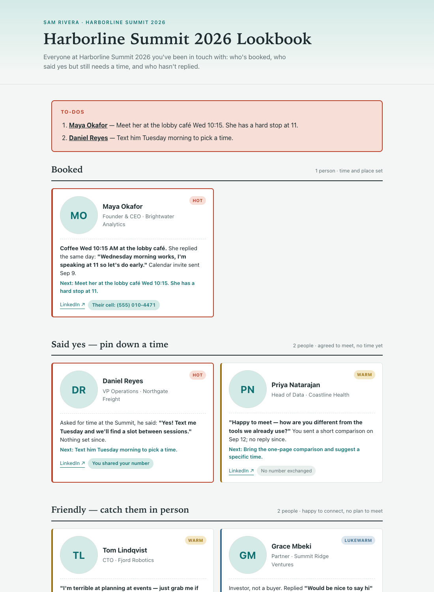

# Event Lookbook

Going to a conference and have been messaging people about meeting up? This turns your Lemlist outreach into a one-page briefing you can read on your phone between sessions. It shows who's booked, who said yes but still needs a time, who's friendly, and who hasn't replied. Every card quotes the line that matters and says what to do next.



Open [`example/index.html`](example/index.html) to see a full sample. Everyone in it is made up.

## What you get

- **A card for everyone you've messaged**, grouped by how far the meetup has got: Booked, Said yes, Friendly, or Invited with no reply. Each card has a photo, title and company, a Hot, Warm, Lukewarm or Cold badge, and a LinkedIn link. It also shows whether you've swapped phone numbers, a short summary of the conversation quoting their key line, and the next step.
- **A to-do list at the top** for anything time-sensitive, like "they asked you to call Monday."
- **Everyone in the campaign, ranked** by how close they are to your ideal buyer, with a one-line reason each. The buyer profile is worked out from the outreach you sent, and shown at the top of the ranking so you can check it.
- **People outside the campaign too.** It searches your other Lemlist conversations for the conference name and asks whether to include each person who mentions it.
- A single `index.html` with the photos built in, which you can open anywhere or AirDrop to your phone, plus a PDF copy.

## Setup

You need Python 3.9 or newer (on a Mac, run `python3 --version` and it will offer to install it if missing) and a Lemlist account.

```sh
git clone https://github.com/dariaarzy/event-lookbook.git
cd event-lookbook
pip3 install anthropic        # for the Claude-written cards (see below)
export ANTHROPIC_API_KEY=...  # from console.anthropic.com
python3 lookbook.py
```

The first run asks four questions:

1. **Your Lemlist API key**, from Lemlist > Settings > Integrations > API.
2. **The campaign name.** Part of it is fine, and you can pick from a list if several match.
3. **The conference name**, the way people would write it in a message.
4. **A Crustdata API key**, which is optional and only used to find headshot photos. Press Enter to skip it and add photos yourself (see below).

Then it pulls everything and writes `my-lookbook/index.html`.

### Why the Anthropic key

Claude reads each thread to decide the stage and warmth, and writes the card. It also ranks the campaign. Without a key you still get a lookbook, but a rough one: anyone who replied lands under "Friendly" with their latest message, there's no ranking, and you sort the rest by hand. A lookbook for about 50 people costs a few dollars in API usage. You can also put the key in `my-lookbook/.env` as `ANTHROPIC_API_KEY=...` rather than exporting it.

## Keeping it up to date

Rerun `python3 lookbook.py` whenever new replies come in, for example each morning of the event. It only redrafts cards whose conversation has changed. It only asks about people outside the campaign it hasn't asked about before.

| Command | What it does |
| --- | --- |
| `python3 lookbook.py` | Pull new replies and rebuild |
| `python3 lookbook.py --offline` | Rebuild from the last pull, without calling any APIs, after you've edited something |
| `python3 lookbook.py --review` | Decide again who outside the campaign to include |
| `python3 lookbook.py --setup` | Answer the four questions again, e.g. for a different event |
| `python3 lookbook.py --example` | Rebuild the sample in `example/` |

## Editing it by hand

Everything the page shows is in `my-lookbook/people.json` (the cards) and `my-lookbook/ranking.json`. Edit either one, set `"locked": true` on anything you change so later runs leave it alone, and run `python3 lookbook.py --offline`.

**To add someone Lemlist doesn't know about**, such as a contact from your own inbox or someone you met at a party, copy an existing card in `people.json`. Give it a new `key` and your details, and set `"locked": true`.

Card fields:

| Field | Values |
| --- | --- |
| `stage` | `booked`, `said_yes`, `friendly`, `awaiting`, or `declined` (hidden) |
| `warmth` | `hot`, `warm`, `lukewarm`, `cold` |
| `context` | A sentence or two. Wrap text in `**double asterisks**` to bold it |
| `action` | The next step, or `""` |
| `todo` | `true` puts the action in the to-do list at the top |
| `phone` | `they_shared`, `you_shared`, `both`, `none` (and `their_phone` for the number) |

## Headshots

Photos are saved in `my-lookbook/headshots/`, named after each person, e.g. `jane-doe.jpg`. The name to use is the `slug` on their card in `people.json`. The tool checks three places:

1. A photo you've put there yourself. It never replaces these.
2. Lemlist's own photo, when the lead has one.
3. Crustdata, looked up by LinkedIn URL, if you gave a key. Each person with a card who has no photo costs one lookup, and people Crustdata can't find aren't looked up again.

Anyone without a photo gets their initials. On a Mac, downloaded photos are shrunk to 320px so the page stays small.

## What it can and can't see

It reads everything in Lemlist:
- your campaign's leads
- each lead's full LinkedIn and email thread, including replies you typed by hand in Lemlist
- your other Lemlist conversations from the last 90 days

It can't see anything outside Lemlist, such as your own Gmail, LinkedIn messages sent outside Lemlist, Slack, or the event's networking app. Add those people by hand as above.

## Privacy

Your keys, the conversations and the lookbook stay on your computer in `my-lookbook/`, which git ignores. The conversations are sent to Anthropic to write the cards. When you use Crustdata, only the LinkedIn URLs of people with cards are sent there.

The lookbook contains other people's messages and phone numbers, so share it only with the people it's for.
